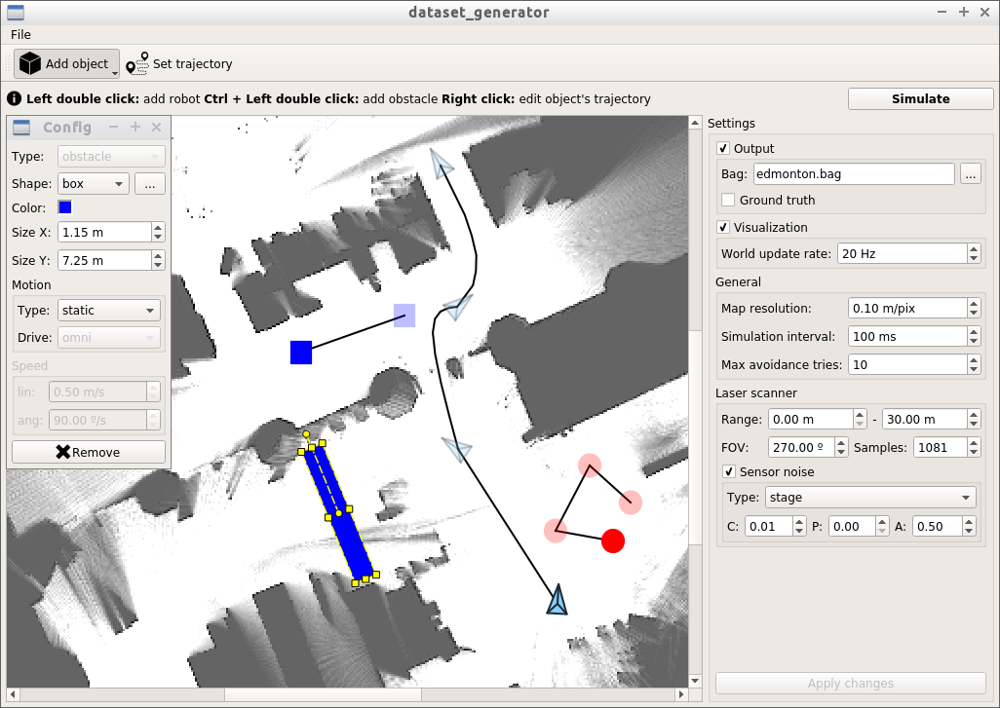
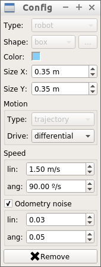

## 2D laser scan based dataset generator for ROS

### Introduction

Currently, there are a few public datasets are available for 2D laser scan based SLAM algorithms evaluation. Most common datasets are [MIT Stata Center](http://projects.csail.mit.edu/stata/) and [Willow Garage](http://google-cartographer-ros.readthedocs.io/en/latest/data.html#pr2-willow-garage). Another example is the [repository](http://www.ipb.uni-bonn.de/datasets/) that provides a set of sequences which are popular in SLAM research. However, the sequences are provided in the CARMEN format that is not convenient to use in ROS. Moreover, the mentioned datasets do not contain sequences with special cases such as long featureless corridors, environments with patterns or with a lot of dynamic objects, omni-wheeled robots, etc. Such cases may be difficult to process for a SLAM algorithm, yet are common for the real world. So evaluation of SLAM algorithms in such environments is essential for the algorithm quality and robustness estimation.

This tool is designed to create 2D laser-based sequences that can be used to evaluate SLAM algorithms. It provides GUI that allows to draw a robot trajectory on a map, add obstacles (static or dynamic), set simulation parameters (such as robot speed, odometry or laser noise) and generate the sensor data as the robot moves through the environment. The output sequences are stored in the [BAG format](http://wiki.ros.org/rosbag) along with ground truth data in the [TUM format](https://vision.in.tum.de/data/datasets/rgbd-dataset/file_formats).

The tool uses [Stage](https://github.com/rtv/Stage) as the underlying simulator.

_**Warning:** the tool currently supports only raster maps and raster-based simulation (limitations of the underlying simulator)._

_**Warning:** the tool is under heavy development so bugs or glitches are possible._

### Install

##### Dependencies

* [ROS](http://www.ros.org/) (>= jade)
* [Qt 5](https://www.qt.io/) (>= 5.7)
* [Stage](https://github.com/rtv/Stage) (> 4.3*)
* [OMPL](http://ompl.kavrakilab.org/)

_**Note:** current Stage version contains critical bugs that prevent the direct use of Stage distribution. This tool is provided with the patch that should be applied to Stage sources in order to build it (see [Building](#building))._

_**Note:** the tool uses [cmake](https://cmake.org) build system._

_**Note:** a compiler must support C++14 in order to build the tool (e.g. gcc >= 5)_

##### Building

* install dependencies **except Stage** (refer to provided links)
* `cd <dataset-generator-root>`
* invoke `./3rdparty/install_stage.sh`
  * the script downloads [Stage 4.3](https://github.com/rtv/Stage/releases/tag/v4.3.0), applies the provided patch `./3rdparty/stage.patch`, builds and installs Stage (`make && make install`) to `./3rdparty/install`
  * _**note:**_ you can manually download and install Stage, but in this case you should pass additional variable to `cmake` when building the tool: `-DSTAGE_INSTALL=/path/to/stage/installation`
* `mkdir build`
* `cd build`
* `cmake ..`
* `make`

### Usage

##### Launch

Launch program (see the image below):
> `./dataset_generator`

Optionally you can specify the path to a map image file to load right after the program launch.

##### Load base map

In the menu select `File -> Load map` (`Ctrl + O`) to choose and load a map. The map should be a raster image (`png`, `jpg`, `pgm`, `ppm` etc).

##### Set the simulation settings

Set the simulation settings on the `Settings` tab:
* `Output` - uncheck to disable bag file generation;
  * `Bag` - specify the path to the output bag file;
  * `Ground truth` - check to generate ground truth in TUM format (will be placed in the same directory as the bag file);
* `Visualization` - uncheck to disable visualization of the simulation process for speed up;
  * `World update rate` - the world redraw rate (determines fps); 
* `General` settings:
  * `Map resolution` - the resolution of the loaded map in meters per pixel;
  * `Simulation interval` - the simulation process discretization (see `<interval_sim>` in the [Stage docs](https://codedocs.xyz/CodeFinder2/Stage/group__world.html));
  * `Max avoidance tries` - maximum robot tries to avoid an obstacle. If a robot cannot avoid an obstacle in the specified number of tries, the simulation process will stop;
* `Laser scanner` sensor settings:
  * `Range` - minimum and maximum measurable ranges of the sensor (see `range_min` and `range_max` in the ROS [LaserScan](http://docs.ros.org/melodic/api/sensor_msgs/html/msg/LaserScan.html) message);
  * `FOV` - the sensor field of view (in degrees);
  * `Samples` - the number of measurements in a `LaserScan` message (together with `FOV` implicitly sets `angle_min`, `angle_max` and `angle_increment` values of a `LaserScan` message);
  * `Sensor noise` - check to simulate sensor noise:
    * `Type` - the noise model; currently only the noise model provided by Stage is supported;
    * `C`, `P`, `A` - constant, proportional and angle components of the noise (see the `noise` parameter [description](https://codedocs.xyz/CodeFinder2/Stage/group__model__ranger.html) for details).

##### Add a robot

In the toolbar select `Add object -> Add robot` (`Alt + R`) and then double click on a free space of the map to add a robot. _**Note:** currently only a single robot can be simulated_. Click on the robot to edit its parameters (see the picture below):

* `Color` - the robot color;
* `Size X`, `Size Y` - the size of robot's bounding box used by OMPL to plan the movement.  _**Note:** currently the robot considered to have a rectangular shape_;
* `Drive` - the robot drive type: differential or omnidirectional;
* `Speed`:
  * `lin` - the maximum linear speed of the robot;
  * `ang` - the maximum angular speed of the robot;
* `Odometry noise` - check to simulate odometry sensor noise (see `odom_error` parameter [description](https://codedocs.xyz/CodeFinder2/Stage/group__model__position.html)):
  * `lin` - the linear component of the noise model;
  * `ang` - the angular component of the noise model.

##### Set the robot trajectory

Select `Set trajectory` (`Alt + T`) tool in the toolbar, then click on a robot to to edit robot's trajectory. Double click on a free space of the map to add a waypoint. `OMPL` will try to generate the path between the newly added and previous waypoints. You can select the newly added waypoint and then the following actions are available:

* drag the waypoint to another location (the path between affected waypoints will be re-generated) or click the `Update` button beside the waypoint to re-generate the path;
* update the robot pose that corresponds to the waypoint by dragging the green handle;
* remove the waypoint by pressing the `Remove` button beside it or by pressing the `Delete` key. If all robot's waypoints are deleted then the robot itself will be deleted from the map.

If `OMPL` cannot generate the path then waypoints will be connected by the red line. In this case, try to reposition one of the waypoints.

##### Simulate the world

When the robot trajectory has at least 2 waypoints and the path between them is valid, then the world simulation becomes available. Click the `Simulate` button to start the simulation. The progress bar beside the button shows the simulation progress. The simulation can be automatically interrupted if the robot cannot avoid some of the obstacles.

##### Add obstacles

Optionally you can add extra obstacles on the map. Select the `Add object -> Add obstacle` (`Alt + O`) tool and then double click on a free space of the map - a default obstacle will be added to the map. Select the obstacle to configure its parameters:

* `Shape` - the object shape: `rect`, `ellipse`, `custom`. You can choose an arbitrary pixmap that represents object's shape. Press `...` to choose another shape.
* `Motion type`:
  * `static` - the object is static;
  * `rand. speed` - the object randomly changes its linear and angular speeds;
  * `rand. pose` - the objects randomly chooses a point on the map and moves to that point;
  * `trajectory` - the object moves along the specified trajectory;
* other parameters are common with robot [parameters](#add-a-robot).

You also can edit obstacle size and origin by dragging a respective handle when the obstacle is selected. You can set obstacle's trajectory in the same way as [robot's](#set-the-robot-trajectory).

### File formats

##### Bag files

The output bag file contains the following topics:

* `/laser_scan` ([`sensor_msgs::LaserScan`](http://docs.ros.org/melodic/api/sensor_msgs/html/msg/LaserScan.html)) - provides laser scan measurements;
* `/tf` ([`tf::tfMessage`](http://docs.ros.org/melodic/api/tf/html/msg/tfMessage.html)) - provides the following transforms:
  * `base_footprint -> base_link` - always identity transform;
  * `odom_combined -> base_footprint` - estimated robot pose.

##### Ground truth files

The output ground truth file contains the ground truth robot trajectory in the following format:

> `timestamp tx ty tz qx qy qz qw`

* `timestamp` - message time stamp (same as in a bag file);
* `tx ty tz` - robot position in robot's coordinate frame;
* `qx qy qz qw` - robot orientation as quaternion.

See the [TUM file formats](https://vision.in.tum.de/data/datasets/rgbd-dataset/file_formats) for details. This file can be directly used in TUM [evaluation utils](https://vision.in.tum.de/data/datasets/rgbd-dataset/tools#evaluation) to estimate SLAM accuracy.

### Planned features

The following major features are planned for implementation:

* project saving and loading;
* freehand trajectory drawing;
* looped trajectories;
* smart obstacle avoidance;
* multiple robot simulation;
* automatic generation of a sequence according to the specified parameters (e.g. robot trajectory length, number of dynamic objects etc).

### Authors

* Artur Huletski
* Dmitriy Kartashov
* Kirill Krinkin

##### Misc

* Icons made by [Smashicons](https://www.flaticon.com/authors/smashicons) and [Gregor Cresnar](https://www.flaticon.com/authors/gregor-cresnar) from www.flaticon.com

Copyright (c) 2018 JetBrains Research, Mobile Robot Algorithms Laboratory
